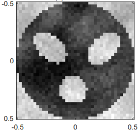

# Deep Jump Gaussian Process (DJGP)

Minimal reference implementation for *Deep Jump Gaussian Processes for Surrogate
Modeling of High-Dimensional Piecewise Continuous Functions*.

This release contains only:

- the user-facing `djgp.model.DJGP` interface and its required implementation;
- the JumpGP, JGP-PCA, JGP-SIR, NGBoost, and BART baselines required by the paper table;
- one deterministic Parkinsons reproduction (`train=1000`, `test=200`, seeds 0–2);
- the exact subject-disjoint splits used by that reproduction;
- the L2 phantom reference image used in the synthetic study.

The old synthetic/UCI experiment harnesses and frozen benchmark-configuration files are
intentionally not included.

## L2 phantom reference



## Environment

Python 3.11 is required. The reported reference run used Python 3.11.15 on CPU. Install
the pinned environment from the repository root:

```bash
python3.11 -m venv .venv
source .venv/bin/activate
python -m pip install -r requirements.txt
python -m pip install -e .
```

## Reproduce the Parkinsons table

Run one command from the repository root:

```bash
python reproduce_parkinson.py
```

No dataset download, GPU, tuning, or arguments are needed. The script verifies the SHA-256
checksums of the committed splits, forces deterministic single-threaded CPU execution, runs
three seeds, and checks that the aggregate metrics match the reference values to two
decimal places. The CSV files retain full numerical precision.

Outputs:

- `results/parkinson_results.csv`: aggregate mean and sample standard deviation;
- `results/parkinson_results_per_seed.csv`: one row per seed and method.

Expected aggregate table:

| Method | RMSE | CRPS | Cov90 |
|---|---:|---:|---:|
| JGP | 10.62 ± 0.08 | 7.49 ± 0.35 | 0.35 ± 0.07 |
| JGP-PCA | 9.96 ± 1.18 | 6.67 ± 1.19 | 0.43 ± 0.08 |
| JGP-SIR | 9.35 ± 0.32 | 6.35 ± 0.55 | 0.43 ± 0.07 |
| NGBoost | 9.69 ± 1.54 | 6.65 ± 1.21 | 0.44 ± 0.09 |
| BART | 10.25 ± 0.78 | 7.06 ± 0.49 | 0.35 ± 0.02 |
| **DJGP-SIR (single member)** | **7.53 ± 1.18** | **4.59 ± 0.54** | **0.95 ± 0.07** |

DGP is deliberately excluded. DJGP uses one SIR-initialized member—there is no ensemble.

## Use DJGP on another dataset

DJGP is transductive: training occurs around the supplied test inputs.

```python
from djgp import DJGP

model = DJGP()
model.fit(X_train, y_train, X_test)
mean, standard_deviation = model.predict()
```

To run a single SIR-initialized member:

```python
model = DJGP(K_members=1, topk=1, init_methods=("sir",))
model.fit(X_train, y_train, X_test)
mean, standard_deviation = model.predict()
```

Constructor options and the `fit`, `predict`, `update`, and `tune` methods are documented in
`djgp.model.DJGP`.
